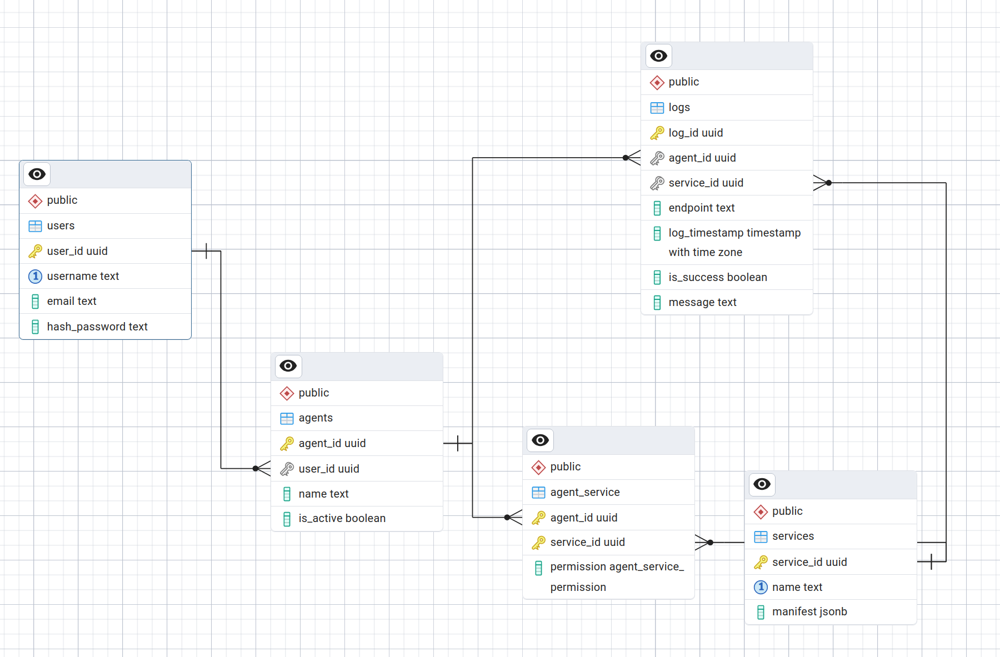

## A very simple agent app to have better controle on what your agent can do

### How to run it:

- download the repo
- add backend/.env.dev and: 
        - SECRET_KEY=
        - ALGORITHM=
        - ACCESS_TOKEN_EXPIRE_MINUTES=
        - REFRESH_TOKEN_EXPIRE_MINUTES=
        - REFRESH_TOKEN_EXPIRE_DAYS=
        - 
        - MAX_FILE_SIZE=  # 10MB
        - 
        - 
        - POSTGRES_DB_URL=
        - POSTGRES_HOST=
        - POSTGRES_PORT=
        - POSTGRES_DATABASE=
        - POSTGRES_USER=
        - POSTGRES_PSWD=
        - API_VERSION=

add database/.env.dev and:
        # env work for both postgres and pgadmin
        - POSTGRES_USER=
        - POSTGRES_PASSWORD=
        - POSTGRES_DB=
        - PGADMIN_DEFAULT_EMAIL=
        - PGADMIN_DEFAULT_PASSWORD=
        - DB_PORT=
        - DB_NAME=
        - DB_HOST=

to run the app:

make build_dev # docker compose build
make up_dev # docker compose up
logs # for the logs

# architecture high overview:

the technical stack is the following:
- FastAPI: the api layer for both the middlware and the app logic
- PostgresSQL: the database logic 

- NextJS: the client interface to create and configure you agents endpoint.

# What the idea ?

the workflow is implemented as following:

the API can be break down in two pieces: the logic router and the middleware router.

the logic router encapsulate all the routes that allow you to configure your agent.
an agent has a name, a status and some attached services. for each attached service you can manage the three permissions:
Admin
Member
Observer

once an agent is configured, you can query the middlware with the following pattern:
/middleware/{service_name}/{endpoint}

this endpoint represent a mapping between our app and the service external capacities that should be map / onboard like so:
{
  "routes": [
    {
      "method": "GET",
      "endpoint": "list-repos",
      "permission": "observer",
      "description": "List repositories accessible to the user"
    },
    {
      "method": "POST",
      "endpoint": "create-issue",
      "permission": "member",
      "description": "Create a new issue in a repository"
    },
    {
      "method": "DELETE",
      "endpoint": "delete-repo",
      "permission": "admin",
      "description": "Delete a repository (destructive operation)"
    }
  ],
  "service": "github"
}

***each new service needs a mapping that fits the manifest***

from that, the middleware can intercept the traffic and extract logs, block request if the permission or policies are not ok.

this is all log in the logs table 

# What should be done next

1) With more time I would have take time to better architecture and design m middleware for a clearer vision of the data that transition. 
probably isolating the middleware in a separate backend to have a seemless integration with external client
something based on the domain name or something like that

2) make the front actually followup the API and think of a clean agent configuration UX

3) tests 